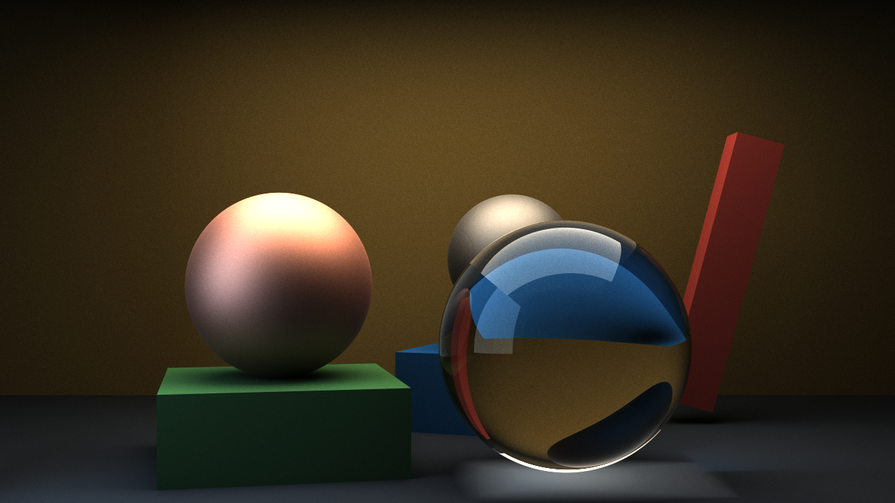
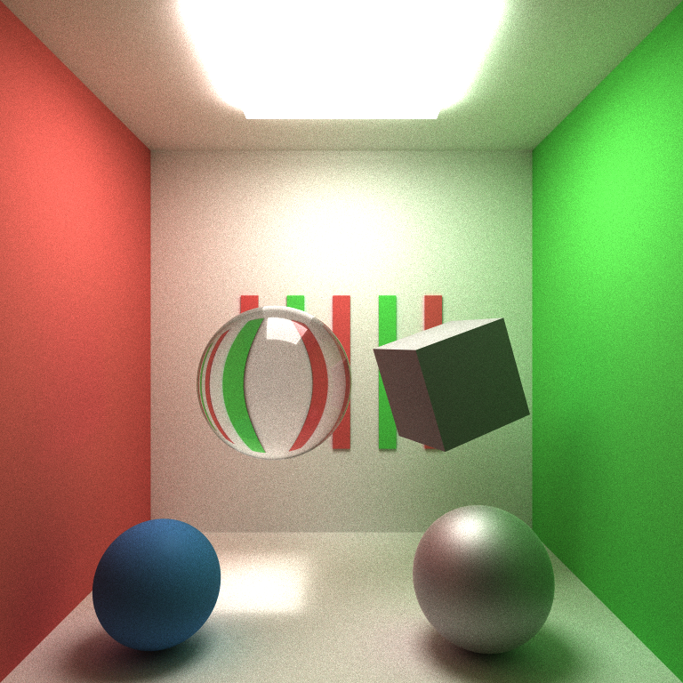
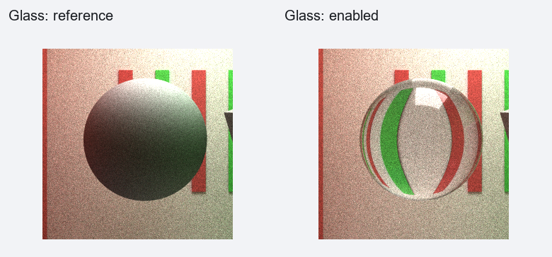
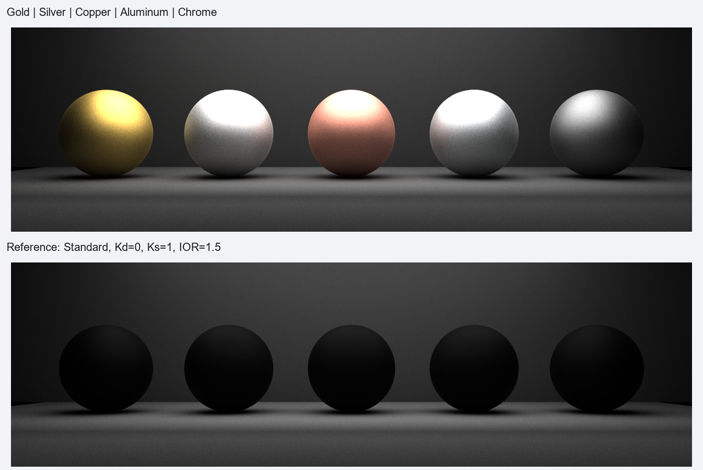
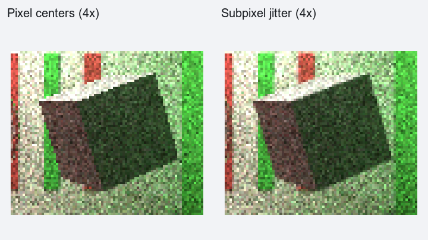
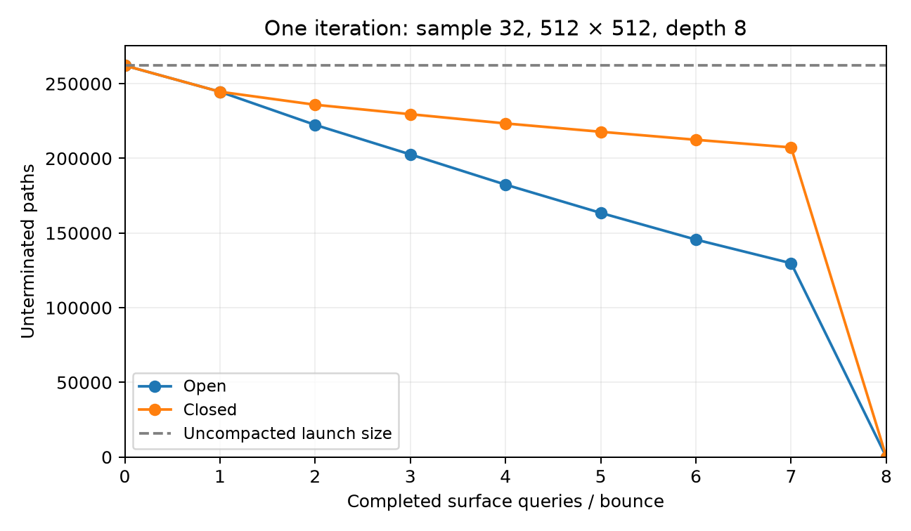
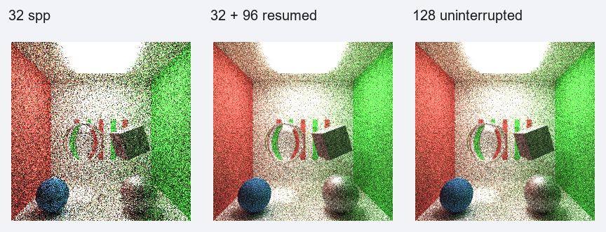

# CUDA Path Tracer

**University of Pennsylvania, CIS 5650: GPU Programming and Architecture,
Project 3 - CUDA Path Tracer**

* Jacob Mollot
  * [LinkedIn](https://www.linkedin.com/in/jacob-mollot-840129182), [Social Media](https://www.instagram.com/come0ndeath27), [YouTube](https://youtu.be/QC5NqphEY24?si=FwLU1xXCVy8uT3Yv)
* Tested on Personal Computer:
  * Windows 11
  * AMD Ryzen 9 7950X 16-core Processor @ 4.50 GHz
  * 128 GB RAM @ 3600 MT/s
  * NVIDIA GeForce RTX 4090 (24 GB), compute capability 8.9



*1280 × 720, 4,096 samples per pixel, maximum path depth 8.*

A CUDA path tracer with measured metal presets, GGX reflection, smooth glass, stochastic antialiasing, and rendering that resumes after the application closes.

Native validation includes CUDA device checks and an exact comparison of uninterrupted and resumed accumulation.

## Materials



*Full room: 768 × 768, 4,096 samples per pixel, maximum path depth 8.*



The glass comparison replaces the sphere's opaque diffuse reference material with smooth glass. Both crops use identical geometry, lighting, camera, and display conversion, from 768 × 768 renders at 1,024 samples per pixel. The full-room image above uses 4,096 samples per pixel.

Standard materials add Lambert or Oren–Nayar diffuse reflection to dielectric GGX reflection. Cosine-weighted diffuse sampling and GGX visible-normal sampling use a full-material BRDF and matching mixture PDF. Kd and Ks are RGB coefficients, not sampling probabilities. The additive model does not enforce a combined energy-conservation constraint on their inputs.

Glass preset 0 uses IOR 1.5, exact unpolarized dielectric Fresnel, Snell refraction, and total internal reflection. Its discrete sampled weights are 1 for reflection and `(etaIncident / etaTransmitted)^2` for radiance transport. Outward geometric normals, oriented shading frames, normalized world rays, and destination-side offsets are handled separately.

Glass supports closed, nonoverlapping solids in air. Rough transmission, nested media, absorption, dispersion, and thin sheets are outside its scope. Standard/Metal roughness retains the existing PBRT polynomial mapping, clamped to an input of 0.001; zero is not a delta mirror.

### Metal presets



*Each source image: 1280 × 384, 2,048 samples per pixel, maximum path depth 8.*

The row uses Gold, Silver, Copper, Aluminum, and Chrome, each with roughness 0.10 and Ks 1. Metal parsing forces Kd to zero and rejects an explicit Kd field. The reference row uses Standard specular-only materials with Kd 0, Ks 1, IOR 1.5, and the same roughness.

`tools/generate_metal_presets.py` performs piecewise linear interpolation of the committed refractiveindex.info datasets at **650/550/450 nm**, stored in **R/G/B** order. Eta and k are dimensionless and not clamped to [0, 1]. This is a three-wavelength RGB approximation, not a full spectral calculation or integrated spectral-to-RGB conversion.

| ID | Preset | eta (R, G, B) | k (R, G, B) |
| --- | --- | --- | --- |
| 0 | Gold | 0.155573770, 0.424149254, 1.383088235 | 3.602444965, 2.472050746, 1.915500000 |
| 1 | Silver | 0.052224824, 0.059582090, 0.040000000 | 4.409358314, 3.597367164, 2.648397059 |
| 2 | Copper | 0.237798595, 1.006626866, 1.240441176 | 3.626414520, 2.582307463, 2.392941176 |
| 3 | Aluminum | 1.558031188, 1.015191782, 0.633238421 | 7.712412686, 6.627283074, 5.454350807 |
| 4 | Chrome (chromium) | 3.107142857, 3.181212121, 2.323000000 | 3.331428571, 3.329090909, 3.135000000 |

The generator and original YAML inputs are included. Regenerate with `py -3 tools/generate_metal_presets.py`; the header records the source hashes. Original publications, interpolation details, and licensing are in [data/ior/SOURCES.md](data/ior/SOURCES.md).

### Actual scene settings

The table records the materials used in the rendered scenes. Full object assignments and camera settings are provided in the linked scene metadata.

| Scene | ID | Name | Type | Kd RGB | Ks RGB | Roughness | IOR/preset | Sigma ° | Emission RGB |
| --- | --- | --- | --- | --- | --- | --- | --- | --- | --- |
| room_open | 0 | light | standard | 0, 0, 0 | 0, 0, 0 | 0.1 | 1.5 | 0 | 9, 9, 9 |
| room_open | 1 | diffuse_white | standard | 0.98, 0.98, 0.98 | 0, 0, 0 | 0.1 | 1.5 | 0 | 0, 0, 0 |
| room_open | 2 | diffuse_red | standard | 0.85, 0.35, 0.35 | 0, 0, 0 | 0.1 | 1.5 | 0 | 0, 0, 0 |
| room_open | 3 | diffuse_green | standard | 0.35, 0.85, 0.35 | 0, 0, 0 | 0.1 | 1.5 | 0 | 0, 0, 0 |
| room_open | 5 | silver | metal | 0, 0, 0 | 1, 1, 1 | 0.1 | preset 1 | — | 0, 0, 0 |
| room_open | 6 | Glass | transmission | 0, 0, 0 | 0, 0, 0 | — | 1.5 | — | 0, 0, 0 |
| room_open | 7 | glossy_blue | standard | 0.25, 0.45, 0.7 | 0.3, 0.3, 0.3 | 0.03 | 1.5 | 0 | 0, 0, 0 |
| room_open | 8 | rough_diffuse | standard | 0.6, 0.6, 0.6 | 0, 0, 0 | 0.1 | 1.5 | 30 | 0, 0, 0 |
| metal_row | 0 | light | standard | 0, 0, 0 | 0, 0, 0 | 0.1 | 1.5 | 0 | 5, 5, 5 |
| metal_row | 1 | floor | standard | 0.28, 0.28, 0.28 | 0, 0, 0 | 0.1 | 1.5 | 0 | 0, 0, 0 |
| metal_row | 2 | backdrop | standard | 0.16, 0.16, 0.16 | 0, 0, 0 | 0.1 | 1.5 | 0 | 0, 0, 0 |
| metal_row | 3 | Gold | metal | 0, 0, 0 | 1, 1, 1 | 0.1 | preset 0 | — | 0, 0, 0 |
| metal_row | 4 | Silver | metal | 0, 0, 0 | 1, 1, 1 | 0.1 | preset 1 | — | 0, 0, 0 |
| metal_row | 5 | Copper | metal | 0, 0, 0 | 1, 1, 1 | 0.1 | preset 2 | — | 0, 0, 0 |
| metal_row | 6 | Aluminum | metal | 0, 0, 0 | 1, 1, 1 | 0.1 | preset 3 | — | 0, 0, 0 |
| metal_row | 7 | Chrome | metal | 0, 0, 0 | 1, 1, 1 | 0.1 | preset 4 | — | 0, 0, 0 |
| metal_row | 8 | overhead_light | standard | 0, 0, 0 | 0, 0, 0 | 0.1 | 1.5 | 0 | 3.5, 3.5, 3.5 |
| cover | 0 | warm_light | standard | 0, 0, 0 | 0, 0, 0 | 0.1 | 1.5 | 0 | 5, 4.5, 3.8 |
| cover | 1 | cool_light | standard | 0, 0, 0 | 0, 0, 0 | 0.1 | 1.5 | 0 | 2.8, 3.4, 4 |
| cover | 2 | stage | standard | 0.12, 0.14, 0.17 | 0.1, 0.1, 0.1 | 0.3 | 1.5 | 0 | 0, 0, 0 |
| cover | 3 | pedestal | standard | 0.21, 0.38, 0.23 | 0, 0, 0 | 0.1 | 1.5 | 30 | 0, 0, 0 |
| cover | 4 | copper | metal | 0, 0, 0 | 1, 1, 1 | 0.1 | preset 2 | — | 0, 0, 0 |
| cover | 5 | glass | transmission | 0, 0, 0 | 0, 0, 0 | — | 1.5 | — | 0, 0, 0 |
| cover | 6 | blue | standard | 0.08, 0.25, 0.48 | 0.3, 0.3, 0.3 | 0.1 | 1.5 | 0 | 0, 0, 0 |
| cover | 7 | chrome | metal | 0, 0, 0 | 1, 1, 1 | 0.1 | preset 4 | — | 0, 0, 0 |
| cover | 8 | red_column | standard | 0.48, 0.18, 0.16 | 0, 0, 0 | 0.1 | 1.5 | 30 | 0, 0, 0 |
| cover | 9 | gold_backdrop | metal | 0, 0, 0 | 1, 1, 1 | 0.3 | preset 0 | — | 0, 0, 0 |

Object assignments, camera settings, and reference alpha values are also exported to [results/materials.json](results/materials.json). The alpha reference uses the same polynomial evaluated in Python float64; it is not a device-bit dump.

### Stochastic antialiasing



The comparison uses the same tilted cube, 256 × 256 resolution, and 256 spp. Pixel-center and jittered images use the same renderer; enlarged crops use nearest-neighbor scaling. PNG output preserves the existing linear RGB clamp and 8-bit quantization; no tone mapping, gamma transform, or per-image rescaling was added.

## Performance

| Software / configuration | Value |
| --- | --- |
| IDE / toolchain | Visual Studio 2022 / MSVC |
| CUDA toolkit | 13.3 |
| C++ / CUDA language standard | C++17 / CUDA17 |
| Build | Release |
| NVIDIA driver | 616.56 |
| GLM | 0.9.6.3 |
| Thrust | 3.3.4 |

Room measurements use 512 × 512; metal-row measurements use 640 × 192. All use depth 8, 32 warm-up iterations, 256 measured iterations, and three serial process repetitions. The tables report the median iteration time per repetition, then the median and min–max of those three values. The middle repetition reverses configuration order.

The timing boundary is the **complete `pathtrace()` call**: ray generation, intersections, shading, sorting, partition, gathering, PBO population, synchronous RGB download, and existing `ERRORCHECK = 1` synchronization. It excludes allocation/startup, CUDA–GL map/unmap, UI presentation, checkpoint I/O, PNG encoding, and shutdown. These are inclusive iteration wall times, not pure kernel times or FPS.

### Sorting and compaction



The plot records **one iteration, sample 32**, with initial and post-bounce active counts, rather than averaging different iterations. Sorting and compaction are enabled for both curves. The uncompacted reference is the fixed launch size. Both room variants keep the camera inside an enclosure extending to z = 12; only the closed variant adds a wall behind it. The emitter sits below the ceiling.

| Scene | Compact | Sort | Median ms | Repetition range | Compaction speedup | Sorting speedup |
| --- | --- | --- | --- | --- | --- | --- |
| open | 0 | 0 | 6.344 | 6.337–6.379 | — | — |
| open | 0 | 1 | 18.479 | 17.861–18.499 | — | 0.343× |
| open | 1 | 0 | 10.691 | 10.686–10.914 | 0.593× | — |
| open | 1 | 1 | 21.421 | 21.406–21.494 | 0.863× | 0.499× |
| closed | 0 | 0 | 6.407 | 6.396–6.416 | — | — |
| closed | 0 | 1 | 18.748 | 18.702–18.860 | — | 0.342× |
| closed | 1 | 0 | 12.229 | 12.213–12.357 | 0.524× | — |
| closed | 1 | 1 | 24.524 | 24.363–24.598 | 0.764× | 0.499× |

Speedups compare toggles within each enclosure while holding the other toggle fixed; values below 1 indicate a slowdown. The closed room contains one additional wall, so its raw time alone does not isolate compaction. Sorting groups material-array IDs, with sorting overhead included in the total. Compaction uses `thrust::partition`, not a custom shared-memory implementation.

Neither material sorting nor compaction improved iteration time in these scenes. Without sorting, compaction increased the median iteration time from 6.344 to 10.691 ms in the open room and from 6.407 to 12.229 ms in the closed room. The closed room retains more active paths, leaving less work for compaction to remove. With compaction enabled, sorting increased iteration time by 100.4% in the open room and 100.5% in the closed room.

These results are consistent with sorting and partition overhead outweighing the work saved in these small scenes. The full-buffer reference skips finished paths, so retaining inactive slots does not mean performing all intersection and shading work for them. The inclusive measurements do not identify the cost of any particular kernel.

Compaction only helps paths that have terminated. Low throughput alone does not terminate a path here. Closed scenes can still terminate on lights, invalid/absorbed samples, and the depth limit. Without compaction, kernels launch over the full buffer and skip finished paths.

### Per-feature analysis

| Feature | Reference ms | Enabled ms | Whole-scene change |
| --- | --- | --- | --- |
| Standard GGX | 21.559 | 21.421 | -0.6% |
| Oren–Nayar | 21.503 | 21.421 | -0.4% |
| Smooth glass | 21.218 | 21.421 | +1.0% |
| Metal Fresnel | 7.195 | 7.199 | +0.1% |

These small observed differences (−0.6% to +1.0%) do not establish that enabling a feature accelerates the renderer. These are **whole-scene** cost comparisons. Changing materials also changes path survival, intersections, and sorting workloads; the timings do not isolate BSDF arithmetic.

| Feature | Existing implementation and GPU versus hypothetical CPU | Possible further optimization (discussion only) |
| --- | --- | --- |
| Standard GGX | Independent paths parallelize, while mixed lobes cause divergence. Visible-normal sampling avoids many poorly oriented microfacets; material sorting attempts to improve coherence. A CPU version avoids warp divergence but has fewer simultaneous paths. | Specialize frequently used material combinations; measure register and branch cost first. |
| Oren–Nayar | Extra per-hit arithmetic runs in parallel on the GPU; the CPU performs the same calculations. No separate Oren–Nayar acceleration was added. | Precompute the sigma-dependent constants. |
| Metals | Preset lookup/interpolation happen on the CPU; optical constants are uploaded in materials and conductor Fresnel is evaluated per hit on the GPU. GGX sampling and sorting are shared with Standard materials. | Inspect Fresnel arithmetic and register pressure before specializing it. |
| Glass | A single Fresnel-selected continuation avoids tracing both branches. Reflection/refraction divergence and longer surviving paths can increase GPU cost; a CPU renderer has the same transport workload without warp divergence. | Evaluate material grouping using the measured sort cost; preserve the transport weights. |
| Restart checkpoints | Serialization and disk I/O run on the CPU, with accumulation uploaded to the GPU on restart. The existing renderer already downloads RGB each iteration. Checkpoint writing is a separate boundary operation, not a per-bounce kernel. | Consider background writing only if measured save stalls justify the added state management. |

| Operation | Resolution | Median ms | Observations | Median bytes |
| --- | --- | --- | --- | --- |
| fresh_gpu_init | 256×256 | 0.559 | 5 | 0 |
| fresh_gpu_init | 512×512 | 0.872 | 33 | 0 |
| fresh_gpu_init | 640×192 | 0.637 | 6 | 0 |
| read_host_restore | 256×256 | 1.698 | 2 | 789422 |
| restore_gpu_init | 256×256 | 0.545 | 2 | 0 |
| save_capture_write | 256×256 | 6.922 | 6 | 789422 |
| save_capture_write | 512×512 | 18.377 | 33 | 3148719 |
| save_capture_write | 640×192 | 14.316 | 6 | 1476657 |

Save timing includes checkpoint capture, packing, write, flush, and replacement. Host restore includes reading, validation, compatibility checks, and restoring host state. GPU initialization includes allocations and scene uploads as well as restored accumulation. Zero bytes for initialization rows means no file is written by that operation. Small observation counts are shown rather than treated as repeated benchmarks.

## Restarting and correctness



The comparison uses 256 × 256, depth 8: 128 uninterrupted samples versus a separate process stopped at 32 and resumed for 96 more samples. Checkpoints store unnormalized binary32 RGB; comparisons check those bits, completed count, camera/controller state, and compatibility metadata. No matching-PNG substitution is used for a failed raw comparison.

| Check | Result |
| --- | --- |
| Native CTest, including actual CUDA kernel checks | PASS |
| Checkpoint-derived PNG matches native export | PASS |
| uninterrupted_vs_resumed | PASS; 0 differing floats; max linear error 0.0 |
| invariance_c0_s0 | PASS; 0 differing floats; max linear error 0.0 |
| invariance_c0_s1 | PASS; 0 differing floats; max linear error 0.0 |
| invariance_c1_s0 | PASS; 0 differing floats; max linear error 0.0 |
| Reject corrupt | PASS |
| Reject truncated | PASS |
| Reject scene | PASS |
| Reject target | PASS |

The native tests exercise the production checkpoint codec and scene parser. `smooth_glass` launches a real CUDA kernel for Fresnel/Snell/TIR, radiance weights, Lambert/mixture/Oren–Nayar/conductor checks, transformed sphere/cube normals, and ray offsets. A missing CUDA device fails this test.

## Build and use

Requires Visual Studio 2022 with C++ and CUDA build support, CUDA 13.3, and CMake 3.24 or newer. Open Developer PowerShell for VS 2022, change to the repository root, and run:

```powershell
cmake -S . -B build -G "Visual Studio 17 2022" -A x64 -DPATH_TRACER_BUILD_TESTS=ON
cmake --build build --config Release
ctest --test-dir build -C Release --output-on-failure
.\build\bin\Release\cis565_path_tracer.exe scenes/generated/cover.json
```

The build includes three native test executables. Python is not required to build or run the renderer or these tests. The metal-preset generator is a separate Python utility; generated headers are committed.

For a short scene preview, override the target sample count:

```powershell
.\build\bin\Release\cis565_path_tracer.exe scenes/generated/cover.json --samples 256
```

To save at 128 samples and continue in a new process to 512 samples:

```powershell
.\build\bin\Release\cis565_path_tracer.exe scenes/generated/room_open.json --samples 512 --checkpoint room.ptc --checkpoint-at 128
.\build\bin\Release\cis565_path_tracer.exe scenes/generated/room_open.json --samples 512 --resume room.ptc
```

In Visual Studio, select **Release**, set **Project Properties → Debugging → Working Directory** to the repository root, and put the scene path/options in **Command Arguments**. The application requires a working OpenGL/CUDA-interop desktop session; no headless mode was added. Default shaders are embedded.

| Control or option | Behavior |
| --- | --- |
| Left / right vertical / middle drag | Orbit / zoom / move lookAt in XZ |
| Space | Recenter lookAt and restart accumulation |
| Sort by material checkbox | Toggle sorting; also available as JSON `sortMaterials` |
| S / Esc | Export PNG / export PNG and exit |
| C | Save a checkpoint and continue |
| `--samples N` | Total target, including restored samples |
| `--checkpoint FILE` | Checkpoint destination; not an autosave switch |
| `--resume FILE` | Restore and continue at saved count + 1 |
| `--checkpoint-at N` | Save at N completed samples and exit **without a PNG** |
| `--stats PREFIX` | Write buffered iteration CSV, active-path CSV, and metadata/checkpoint-I/O JSON |

Normal sample-target completion exports `<Camera.FILE>.<UTC-start-time>.<N>samp.png` and exits. Resume with a target equal to the completed count, omitting `--checkpoint-at`, to export without more tracing.

Checkpoint compatibility includes rendering build identity, scene content, resolution, and depth. Target samples, output FILE, and JSON sorting are excluded from scene identity, but **resume restores the saved sorting flag**. Compaction/AA JSON flags remain part of scene identity. Keep the matching executable when retaining checkpoints; incompatible rendering builds are rejected.

## Scene format and CMake changes

Use lowercase `materials` as an array, lowercase `type`, and lowercase numeric object `material` indices. `Camera`, `Objects`, and transform keys remain uppercase. Material names and object names are descriptive; assignment is by index. This is a custom format, not a glTF importer.

| Material/input | Supported values and defaults |
| --- | --- |
| Standard | Kd/Ks are scalar or RGB in [0, 1], both default 0.25; IOR ≥ 1, default 1.5; sigma [0, 90] degrees, default 0 |
| Standard/Metal roughness | [0, 1], default 0.10; polynomial mapping applied once |
| Metal | Required preset 0–4; Ks defaults to 1; Kd forced to zero; rejects Kd/ior/diffuseSigmaDegrees |
| Transmission | Required preset 0; rejects Kd/Ks/ior/roughness/diffuseSigmaDegrees/metalPresetID |
| Emission | Color RGB in [0, 1], default zero; strength ≥ 0, default 1; a positive emitted component makes a terminal light |
| Objects | TYPE cube/sphere; material index; TRANS; ROTAT in degrees; SCALE; unit cube spans ±0.5 and sphere radius is 0.5 |
| Camera | RES, FOVY, ITERATIONS, DEPTH, FILE, EYE, LOOKAT, UP |
| Top-level controls | sortMaterials, compactPaths, antialiasing; all default true |

The current projection uses `tan(FOVY)`, so FOVY is a half-angle for the level cameras used here. DEPTH limits surface queries; terminal emission is still checked on the last query. Complete examples are in [scenes/generated](scenes/generated). The legacy `scenes/sphere.json` uses the older material schema; use the generated scenes or `scenes/cornell_glass.json` with this renderer.

Relevant build configuration and changes, explicitly documented:

- CMake 3.24 minimum, native CUDA language, C++17/CUDA17, architecture `native`, and separable compilation.
- CUDA include paths and MSVC `/Zc:preprocessor` forwarding.
- Interaction/checkpoint sources, generated preset headers, and `cmake/CheckpointBuildIdentity.cmake`; rendering source/settings changes invalidate old checkpoints.
- `PATH_TRACER_BUILD_TESTS` defaults OFF. When enabled, it builds the checkpoint, CUDA material, and scene-parser tests. The parser test uses `cornell_glass.json`.
- Release uses `-lineinfo;-src-in-ptx`; **Debug and RelWithDebInfo use -G**. Reported measurements use Release.
- Project 2 stream-compaction linkage remains commented out; current compaction uses Thrust. Existing OpenGL/GLFW/GLEW/GLM/ImGui dependencies remain.

## Results and credits

The cover was rendered to a 2,048-sample checkpoint, then resumed in a new process to 4,096 samples. The separate correctness test compares resumed and uninterrupted accumulation exactly.

Recorded evidence: [performance CSV](results/performance.csv), [per-iteration CSV](results/iterations.csv), [active-path CSV](results/active_paths.csv), [checkpoint comparisons](results/checkpoint_comparison.json), [checkpoint I/O](results/checkpoint_io.csv), and [material settings](results/materials.json). The figures and tables above provide the results without requiring a rerun.

Based on the CIS 5650 CUDA Path Tracer starter. Retained source credits include GLSL utilities by Varun Sampath, Patrick Cozzi, and Karl Li / University of Pennsylvania, and utility code by Yining Karl Li. Dependencies include CUDA/Thrust, GLM, GLFW, GLEW, Dear ImGui, stb_image_write, and nlohmann/json.

- [PBRT](https://pbr-book.org/): Fresnel, Oren–Nayar, GGX visible-normal sampling, and roughness mapping.
- [PBRT v4 dielectric BSDF](https://pbr-book.org/4ed/Reflection_Models/Dielectric_BSDF.html) and [specular reflection/transmission](https://pbr-book.org/4ed/Reflection_Models/Specular_Reflection_and_Transmission): smooth dielectric sampling and radiance weighting.
- [refractiveindex.info database](https://github.com/polyanskiy/refractiveindex.info-database), [CC0 1.0](https://creativecommons.org/publicdomain/zero/1.0/). Local data retain original publication references; see [SOURCES.md](data/ior/SOURCES.md).

- Gold: [Au-Johnson.yml](https://raw.githubusercontent.com/polyanskiy/refractiveindex.info-database/master/database/data/main/Au/nk/Johnson.yml).
- Silver: [Ag-Johnson.yml](https://raw.githubusercontent.com/polyanskiy/refractiveindex.info-database/master/database/data/main/Ag/nk/Johnson.yml).
- Copper: [Cu-Johnson.yml](https://raw.githubusercontent.com/polyanskiy/refractiveindex.info-database/master/database/data/main/Cu/nk/Johnson.yml).
- Aluminum: [Al-Rakic.yml](https://raw.githubusercontent.com/polyanskiy/refractiveindex.info-database/master/database/data/main/Al/nk/Rakic.yml).
- Chrome (chromium): [Cr-Johnson.yml](https://raw.githubusercontent.com/polyanskiy/refractiveindex.info-database/master/database/data/main/Cr/nk/Johnson.yml).

All scene geometry uses the renderer's sphere and cube primitives.
